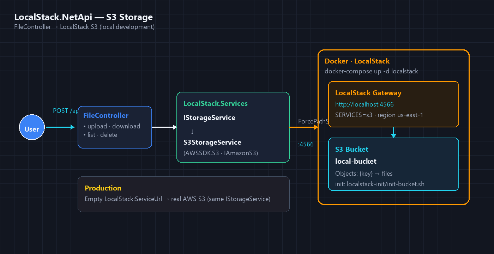

# LocalStack.NetApi
.NET 10 API with local S3 storage simulated via LocalStack.

## Architecture


## Requirements
- .NET 10 SDK
- Docker (LocalStack)

## Structure
- **LocalStack.Api** — controllers, configuration, middleware
- **LocalStack.Services** — application logic (`IStorageService`, items)
- **LocalStack.Repository** — data access (in-memory)
- **LocalStack.Models** — DTOs

## Run
```bash
docker-compose up -d localstack
dotnet run --project LocalStack.Api
```

Swagger in Development: `http://localhost:{port}/swagger`

## LocalStack (S3)
LocalStack runs at `http://localhost:4566`. The `local-bucket` bucket is created when the container starts or when the API boots.

Configuration in `appsettings.Development.json` → `LocalStack` section. For real AWS, leave `LocalStack:ServiceUrl` empty and use the standard `AWS` section.

| Method | Route | Description |
|--------|-------|-------------|
| POST | `/api/v1/file/upload` | Upload file (`file`, optional `key`) |
| GET | `/api/v1/file/download/{key}` | Download |
| GET | `/api/v1/file/list` | List keys |
| DELETE | `/api/v1/file/{key}` | Delete |

## Docker (API)
```bash
docker build -f Dockerfile -t localstack-netapi:latest .
docker run -d -p 8787:80 -e ASPNETCORE_ENVIRONMENT=Development --name localstack-netapi localstack-netapi:latest
```