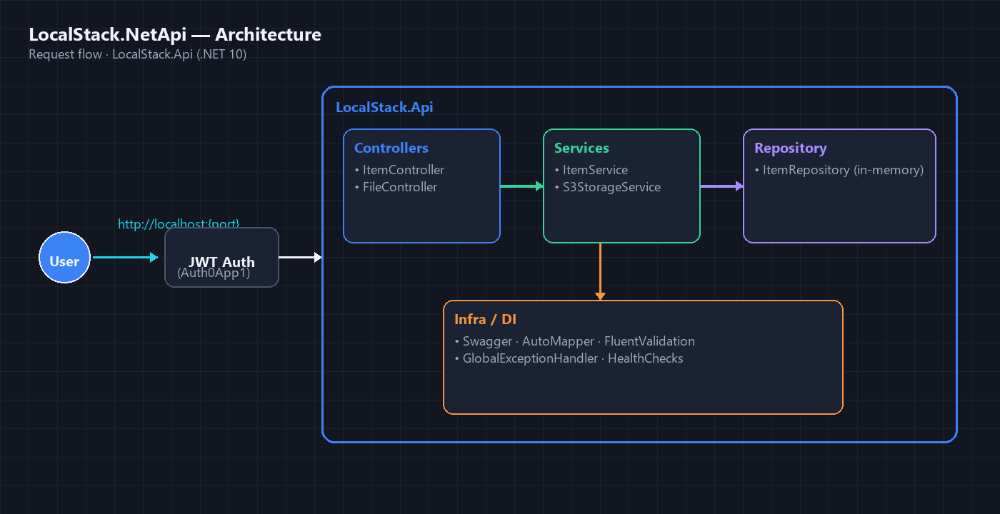
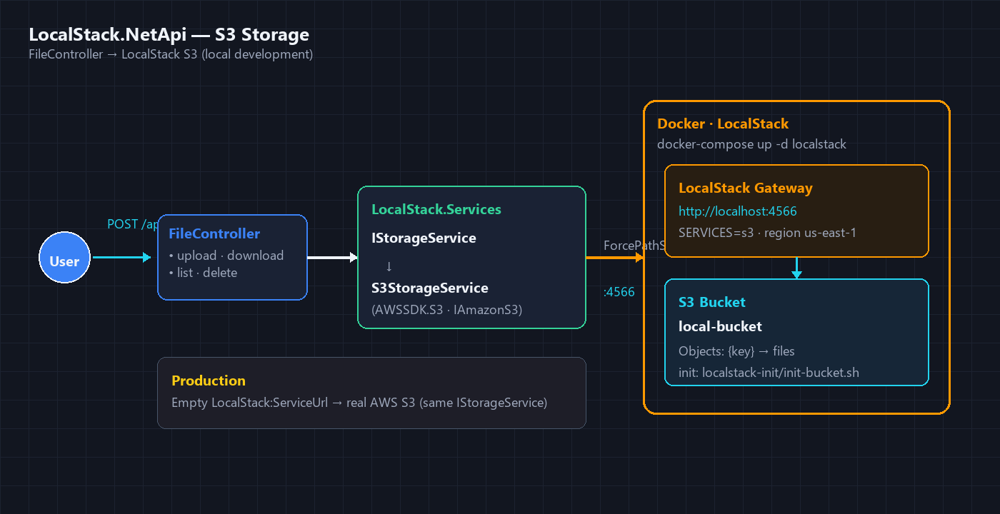

# LocalStack.NetApi
A .NET 10 Web API that uses LocalStack to simulate AWS S3 for file storage in local development.

## Architecture 🏗️




## Requirements ✅
- 🧰 .NET 10 SDK
- 🐳 Docker (for LocalStack)

## Structure 📦
- **LocalStack.Api** - controllers, configuration, middleware
- **LocalStack.Services** - application logic (`IStorageService`, items)
- **LocalStack.Repository** - data access (in-memory)
- **LocalStack.Models** - DTOs

## Run ▶️
```bash
docker-compose up -d localstack
dotnet run --project LocalStack.Api
```

By default the API listens on `http://localhost:5142`. Swagger is available in Development at `/swagger`.

Useful checks:

- `GET /health` - basic health
- `GET /health/ready` - includes S3 / LocalStack connectivity

## LocalStack (S3) 🪣
LocalStack runs at `http://localhost:4566`. The `local-bucket` bucket is created when the container starts or when the API boots.

Settings live in `LocalStack.Api/appsettings.Development.json` under the `LocalStack` section. To point at real AWS instead, leave `LocalStack:ServiceUrl` empty and use the standard `AWS` section.

| Method | Route | Description |
|--------|-------|-------------|
| POST | `/api/v1/file/upload` | Upload a file (`file`, optional `key`) |
| GET | `/api/v1/file/download/{key}` | Download by key |
| GET | `/api/v1/file/list` | List keys in the bucket |
| DELETE | `/api/v1/file/{key}` | Delete by key |

You can also try the sample requests in `LocalStackApi.http`.

## Docker 🐳
```bash
docker build -f Dockerfile -t localstack-netapi:latest .
docker run -d -p 8787:80 -e ASPNETCORE_ENVIRONMENT=Development --name localstack-netapi localstack-netapi:latest
```
